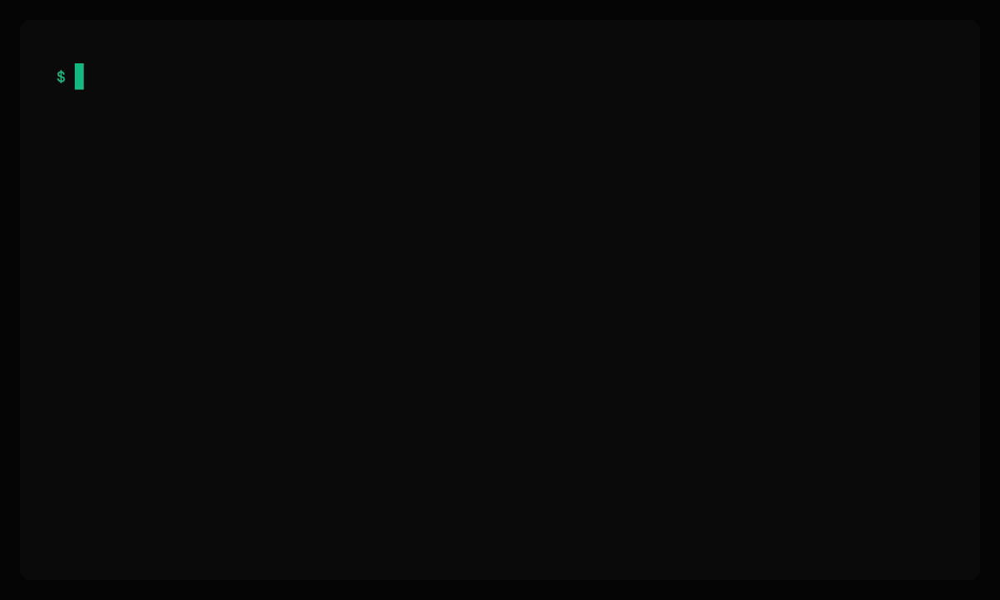

<div align="center">

# 🤖 Feedbot

### Turn community chat into a structured product backlog — and let any AI agent resolve it.

[](https://github.com/helderpgoncalves/feedbot/actions/workflows/ci.yml)
[](https://github.com/helderpgoncalves/feedbot/releases)
[](LICENSE)
[](https://www.python.org)
[](https://modelcontextprotocol.io)
[](docs/DEPLOY-COOLIFY.md)
[](CONTRIBUTING.md)
[](https://github.com/helderpgoncalves/feedbot/discussions)

**[Quickstart](#-quickstart-docker-5-minutes) · [Architecture](#how-it-works) · [Deploy](docs/DEPLOY-COOLIFY.md) · [Security](SECURITY.md) · [Contributing](CONTRIBUTING.md)**

</div>

---

## What it does

Drop the bot in your **Telegram** group. Users post bugs, ideas, and feature requests in plain language. Feedbot captures and structures them — optionally **auto-triaged by an LLM** (OpenAI or Anthropic, plug-in registry for more). Your team triages from a clean **React dashboard**. Any **MCP-compatible client** (Claude Code, Claude Desktop, Cursor, Windsurf, …) picks up tickets via the bundled **MCP server** (HTTP-native, no proxy process), ships the fix, and the original reporter is notified back **in the same chat** — replies they send route straight to the right ticket.

```
   ┌──────────────┐                              ┌──────────────────┐
   │   Telegram   │  bot files structured row    │   Feedbot API    │
   │   group      │ ─────────────────────────►   │   (FastAPI +     │
   │              │ ◄── reply / done in chat ─── │    Postgres)     │
   └──────────────┘     (same thread, no DM)     └────────┬─────────┘
                                                          │ LLM classify
                                                          │ (per project)
   ┌──────────────┐    Bearer fbk_live_*                  ▼
   │  MCP client  │ ◄────── HTTP /mcp ──────────►  ┌──────────────┐
   │  (any agent) │                                │ OpenAI /     │
   │              │      "Mark FB-A3F2 done"       │ Anthropic /  │
   └──────────────┘                                │  …registry   │
                                                   └──────────────┘
                       ┌─────────────────┐
                       │  React SPA      │
                       │  team · projects│
                       │  keys · MCP cfg │
                       └─────────────────┘
```

You stay in your editor. Reporters stay in their chat. Nothing falls through.

---

## ✨ Highlights

| | |
|---|---|
| 🛡️ **Closed by default (self-host)** | First-run setup creates the `owner`. After that, the only way in is by invitation — no public sign-up. Cloud deployments can flip on signup with one env var. |
| 👥 **Three simple roles** | `owner` / `admin` / `member`. Members only see projects they were explicitly added to. Designed to be obvious, not powerful. |
| 🤝 **One bot, N projects** | A single Telegram bot serves every project. Each chat is bound to exactly one project; routing is decided server-side from `chat_id`. |
| ✨ **Frictionless onboarding** | Click *"Generate invite"* in the dashboard → tap *Open Telegram → Add to group* → done. Bot confirms the link in chat. No tokens to type. |
| 🧠 **LLM auto-triage** | OpenAI or Anthropic structured outputs fill `type`, `severity`, `summary`, `tags`, `language`, `sentiment` on every inbound message. Per-project config, encrypted keys, monthly budget cap, full cost audit. Plug-in registry for new providers. |
| 🧰 **MCP over HTTP — any client** | Native MCP at `/mcp` on the API. Works with Claude Code, Claude Desktop, Cursor, Windsurf, Zed, Continue, or any agent using the MCP SDK. The dashboard generates ready-to-paste config for each. 9 tools including `request_more_info` for in-chat clarification. |
| 💬 **Conversational loop** | Replies and resolutions come back to the **same chat** the feedback was reported in. When the reporter answers, the message is captured as `user_reply` and the ticket flips back to `triaged` automatically. **Same loop also drives the dashboard's reply queue UI**, so you don't need an MCP client to hold a conversation. |
| 🚀 **Coolify-deployable** | Two Docker Compose services (api + web), one Postgres, two domains (or one + path), TLS automatic. Step-by-step in [`docs/DEPLOY-COOLIFY.md`](docs/DEPLOY-COOLIFY.md). |
| 🔒 **Hardened by default** | Argon2id-hashed API keys, server-side bot tokens with constant-time compare, Fernet-encrypted LLM keys at rest, server-side sessions in `Strict` cookies, HSTS, CSP, rate limiting on auth routes, fail-closed on missing SMTP. |
| 🪞 **Boring tech, on purpose** | Backend: FastAPI · SQLAlchemy 2 async · Postgres · Alembic. Frontend: React 19 · TanStack Router · TanStack Query · shadcn/ui · Tailwind. Easy to read, fork, and contribute to. |

---

## 🚀 Quickstart (Docker, 5 minutes)

<p align="center">
  
</p>

> One-liner install on a fresh box:
> ```bash
> curl -fsSL https://get.feedbot.dev | sh
> ```
> Or install from source (below):

```bash
git clone https://github.com/helderpgoncalves/feedbot.git
cd feedbot
cp .env.example .env

# Generate strong dev secrets — paste each line into .env
python -c "import secrets; print('FEEDBOT_SECRET_KEY=' + secrets.token_urlsafe(48))"
python -c "import secrets; print('FEEDBOT_BOT_TOKEN='  + secrets.token_urlsafe(32))"

docker compose up --build -d
```

Three services come up: `db` (Postgres), `api` (FastAPI on `:8000`), and `web` (the React SPA on `:3000`).

Open <http://localhost:3000>:

1. The SPA detects the empty database and routes you to **`/setup`**.
2. Enter your owner email + workspace name → submit.
3. The magic link prints in the API logs (`docker compose logs api | grep "magic link"`); open it.
4. You land at `/projects` as the owner. Create projects, invite teammates from the **Team** page, connect a Telegram chat from a project's **Telegram chats** card.

> **No SMTP locally?** That's fine — the link prints in logs. For production deploys, [`docs/DEPLOY-COOLIFY.md`](docs/DEPLOY-COOLIFY.md) has the full SMTP walkthrough. **`EMAIL_BACKEND=console` over HTTPS is refused** so you can't accidentally lock yourself out.

Full walkthrough — including SMTP, Telegram bot setup, and end-to-end smoke tests — in **[`docs/E2E.md`](docs/E2E.md)**.

> 💡 **Want to deploy this on the public internet?** Skip to **[`docs/DEPLOY-COOLIFY.md`](docs/DEPLOY-COOLIFY.md)** — managed Postgres, Let's Encrypt, SMTP, the works. ~25 minutes.

---

## 🔌 Wire up an MCP client

The Feedbot API serves the MCP protocol natively over **Streamable HTTP** at `/mcp`. No extra process to run; auth is the project's API key. Reference: <https://code.claude.com/docs/en/mcp>.

The fastest path: open a project in the dashboard → scroll to **Connect via MCP** → copy the snippet for your client. The dashboard fills in the URL and a freshly-issued key for you. Below is the manual reference.

### Claude Code (CLI)

```bash
claude mcp add --transport http feedbot https://your-feedbot.example.com/mcp/ \
  --header "Authorization: Bearer fbk_live_..."
```

### `.mcp.json` / `claude_desktop_config.json` / Cursor / Windsurf

```json
{
  "mcpServers": {
    "feedbot": {
      "type": "http",
      "url": "https://your-feedbot.example.com/mcp/",
      "headers": {
        "Authorization": "Bearer fbk_live_..."
      }
    }
  }
}
```

### Any other MCP client

Three pieces of information do it:

| Field         | Value                                              |
| ------------- | -------------------------------------------------- |
| URL           | `https://your-feedbot.example.com/mcp/`            |
| Transport     | Streamable HTTP                                    |
| Authorization | `Authorization: Bearer fbk_live_...`               |

> **Different projects get different keys.** Each workspace has its own key. Same MCP server, isolated data — guaranteed by the auth layer.

In your agent: *"What new bugs do we have?"* — done.

> **The legacy stdio package (`feedbot-mcp`) still works** for environments that can't reach an HTTP MCP server, but new deployments should use the HTTP endpoint. The dashboard only generates HTTP snippets.

---

## How it works

### Identity & access

```
   ┌────────────────────────────────────────────────────────────┐
   │ Tenant (your workspace)                                    │
   │                                                            │
   │   ┌────────┐     ┌────────┐     ┌──────────┐               │
   │   │ owner  │ ◄── │ admin  │ ◄── │ member   │               │
   │   │ (1)    │     │ (N)    │     │ (N)      │               │
   │   └────────┘     └────────┘     └────┬─────┘               │
   │      │              │                │                     │
   │      └──────────────┴────────────────┘ visible projects    │
   │                     ▼                                      │
   │            ┌──────────────────┐                            │
   │            │ Project A,B,C…   │   API keys, chat-links,    │
   │            │                  │   members, feedback inbox  │
   │            └──────────────────┘                            │
   └────────────────────────────────────────────────────────────┘
```

| Role | Can do |
|---|---|
| `owner` | Everything. Created via `/setup` (self-host) or signup (cloud). Singular per tenant. Cannot be deleted; can transfer the role. |
| `admin` | Invite teammates, create/delete projects, manage keys, manage chat-links, manage members. |
| `member` | See and triage feedback **only in projects they're added to**. No tenant-wide actions. |

### Multi-project routing — same bot, multiple groups

```
                          ┌─────────────────────────────────┐
                          │  feedbot-api                    │
                          │                                 │
   /start link_<token> ──►│  /v1/internal/redeem-link       │──► chat_links: (telegram, -100…) → project A
                          │                                 │
   message in group A  ──►│  /v1/internal/ingest            │──► resolve via chat_links → A → new feedback
                          │                                 │
   message in group B  ──►│  /v1/internal/ingest            │──► resolve via chat_links → B → new feedback
                          └─────────────────────────────────┘
```

- The dashboard issues a single-use, 15-minute deep-link token from the project's **Telegram chats** card.
- Telegram's `?startgroup=link_<token>` brings the user (with the bot) into a group of their choice.
- The bot calls `/v1/internal/redeem-link` with `(chat_id, token)` → server records the binding.
- Every subsequent message in that chat is ingested against that project.
- `UNIQUE(platform, chat_id)` makes it physically impossible for a chat to belong to two projects.
- Bot ↔ API uses a **separate** server-side secret (`FEEDBOT_BOT_TOKEN`), never exposed to clients.

---

## 📦 What's in this repo

A monorepo. One install, four publishable packages plus the SPA.

```
feedbot/
├── apps/
│   ├── web/             # React SPA: dashboard, auth, setup wizard, MCP onboarding
│   ├── marketing/       # Astro + Starlight: landing + docs at feedbot.dev
│   └── installer-host/  # Static host for install.sh at get.feedbot.dev
├── packages/
│   ├── feedbot-core/    # SQLAlchemy 2 models, repos, IDs, Argon2 hashing, LLM registry
│   ├── feedbot-api/     # FastAPI JSON server (/v1/*) + native MCP (/mcp/*) — no HTML
│   ├── feedbot-bot/     # Telegram adapter (one bot, many projects)
│   └── feedbot-mcp/     # Legacy MCP stdio bridge (kept for compat; prefer /mcp HTTP)
├── alembic/             # Single shared schema migrations
├── docker-compose.yml   # db + api + web + (opt-in) bot
├── scripts/seed.py      # CLI: bootstrap owner / project / API key
└── docs/
    ├── ARCHITECTURE.md
    ├── DEPLOY-COOLIFY.md
    ├── DEPLOYMENT.md
    └── E2E.md
```

| Component | Role | Runs where |
|---|---|---|
| `apps/web` | React SPA. Same Docker image works for cloud and any self-host — runtime config (`/config.json`) is templated by Caddy from env vars on every request, so you change `docker-compose.yml` and `restart`, never rebuild. | Server (Caddy on `:80`, exposed as `:3000`) |
| `feedbot-core` | Domain primitives — models, repos, ID generation, Argon2 hashing, **LLM provider registry + classification + Fernet crypto + pricing table**. **No FastAPI, no Telegram.** | Imported by api/bot |
| `feedbot-api` | JSON API (`/v1/*`), magic-link auth, **MCP server at `/mcp`**, outbound queue endpoints. **Source of truth.** | Server (`:8000`) |
| `feedbot-bot` | Global Telegram bot. Resolves project from `chat_id`. **Polls the outbound queue every 5s** to deliver replies and done-notifications, and routes Telegram-reply messages back to the right feedback. | Server (one process serves N projects) |
| `feedbot-mcp` | Legacy MCP stdio bridge — thin HTTP client for environments that can't reach the HTTP endpoint. Most users should use the HTTP endpoint directly. | Developer's machine |

The SPA and the API run as **separate services**. In production, Caddy in the `web` container reverse-proxies `/api/*`, `/mcp/*`, `/login`, and `/setup` to the API container so the browser sees a single same-origin host — no CORS, cookies stay `SameSite=Strict`.

---

## ☁️ Cloud vs self-host

The same Docker image works for both. Two env vars on the `web` container decide which mode:

| Env var | Self-host (default) | Cloud |
|---|---|---|
| `FEEDBOT_DEPLOYMENT` | `self-host` | `cloud` |
| `FEEDBOT_ALLOW_SIGNUP` | `false` | `true` |

**Self-host** is invite-only after the first owner is bootstrapped via `/setup`. One tenant, one workspace — invite teammates via the Team page. **This is fully working today.**

**Cloud** flips public sign-up on so anyone can land on `app.<your-domain>` and create their own tenant. The signup endpoint is rate-limited and only active when `FEEDBOT_ALLOW_SIGNUP=true`. Stripe billing, plan-tier quotas, and GDPR endpoints are tracked under M5/M6 — not yet shipped.

If you're not sure which you want: **start with self-host**. It's the demo customers see when they evaluate the cloud version, and the path most contributors take.

---

## 🧠 LLM auto-triage (optional, per project)

Every inbound feedback can be auto-filled with `type`, `severity`, `summary`, `tags`, `language`, and `sentiment` using **OpenAI** or **Anthropic** structured outputs. Configured per project from the project page → **LLM** tab:

- **Provider dropdown** populated from the registry (`feedbot_core/llm/providers/`). Adding a new provider tomorrow is one file with `@register("name")`; the dropdown picks it up automatically.
- **API key encrypted** at rest with Fernet (key derived from `FEEDBOT_SECRET_KEY`). Never re-rendered.
- **Test connection** runs a real classification round-trip and stores the outcome (`last_test_ok` / `last_test_error`).
- **Cost tracking** — every call writes a row to `llm_calls` (provider, model, tokens, USD cost from `feedbot_core/llm/pricing.py`, latency, status). The settings page shows month-to-date spend and the last 50 calls.
- **Monthly budget cap** — optional `monthly_budget_usd`. When the running total hits the cap, classification stops and is audited with `status=over_budget` until the next month. Ingest never fails because of LLM.

Disabled by default. The pipeline degrades gracefully — if no settings exist, classification is skipped (`status=disabled`) and the feedback flows through unchanged.

---

## 💬 Conversational loop (M4)

Replies don't open a DM. They land in the **same chat** the feedback was reported in, prefixed with `[FB-XXXXXX]`. Triage them from the **dashboard's reply queue UI** *or* an MCP client — same endpoints, same loop:

```
   user @ Telegram group
       │ "@bot the export crashes on iOS"
       ▼
   feedbot-bot ──ingest──► feedbot-api  (LLM classifies → row)
                                │
   team via dashboard ─────────┐│
   or MCP client ──reply_to_user┘
                                │  outbound queue
                                ▼
   feedbot-bot ──Telegram sendMessage──► same group
                                          │  "[FB-A3F2] which iOS version?"
                                          ▼
   user replies (Telegram-reply to that message)
                                │
                                ▼
   feedbot-bot ──ingest-reply──► feedbot-api
                                  ├─ writes user_reply
                                  └─ status → triaged

   status flips to done ──► bot posts "✅ FB-A3F2 resolved." in the chat
```

The bot polls `/v1/internal/outbound-pending` every 5 seconds, delivers, and ack's via `/v1/internal/outbound-ack`. The Telegram `message_id` is stored, so when the reporter replies, `/v1/internal/ingest-reply` matches it back to the correct feedback row.

---

## 🛠️ The MCP tools

Nine tools, served from `/mcp`. Read-only keys cannot mutate.

| Tool | What an agent does with it |
|---|---|
| `list_feedbacks` | *"What's in the new bug pile?"* — filter by status / type / severity |
| `get_feedback` | *"Pull up FB-A3F2."* |
| `search_feedbacks` | *"Have we seen this export crash before?"* — substring on title + body |
| `update_status` | *"Mark FB-A3F2 done — fixed in PR #91."* |
| `add_note` | *"Note on FB-B7C1: needs design review."* |
| `reply_to_user` | *"Tell the reporter of FB-A3F2 it's fixed in v2.4.0."* — delivered to the same chat |
| `request_more_info` | *"Ask the reporter for their iOS version."* — replies + resets status to `triaged` |
| `create_feedback` | Programmatic creation when the agent spots an issue itself |
| `get_stats` | *"How's the pipeline?"* — counts grouped by status |

---

## 🗺️ Roadmap

- **M1** ✅ — Telegram, dashboard, MCP, multi-project, deep-link onboarding, magic-link auth.
- **M1.1** ✅ — Roles (owner/admin/member), invites, per-project membership, security hardening, Coolify deploy guide.
- **M1.5** ✅ — `/mcp` streamable-HTTP endpoint on the API. Stdio bridge kept for compat. ([#7](https://github.com/helderpgoncalves/feedbot/pull/7))
- **M3** ✅ — LLM auto-triage with OpenAI / Anthropic, plug-in provider registry, encrypted keys, per-project monthly budget caps, full cost audit. ([#8](https://github.com/helderpgoncalves/feedbot/pull/8))
- **M4** ✅ — Outbound delivery worker + conversational loop. Replies and `done` notifications land in the original chat; reporter replies route back as `user_reply`. ([#9](https://github.com/helderpgoncalves/feedbot/pull/9))
- **F3 / F7** ✅ — React SPA replaces the legacy Jinja UI. JSON-only API. Dashboard exposes API-keys, "Connect via MCP" snippets, members, Telegram chat-links, and the conversational loop's reply queue.
- **M2** — WhatsApp via Baileys sidecar (self-hosted; points at your API).
- **M5** — Cloud signup + Stripe billing + plan-tier quotas + GDPR endpoints.
- **M6** — Additional LLM providers via the registry (Gemini, Groq, Ollama).

See [`docs/ARCHITECTURE.md`](docs/ARCHITECTURE.md) for the full design.

---

## 🔒 Security

- **Closed login (self-host)** — `/v1/auth/login` returns a generic response whether the email exists or not. No enumeration.
- **No public sign-up by default** — only the bootstrap `/setup` flow and admin-issued invites can create accounts. Cloud deployments enable signup explicitly via `FEEDBOT_ALLOW_SIGNUP=true`.
- **API keys** — Argon2id-hashed at rest. Only the `fbk_<env>_<8>` prefix is visible. Constant-time prefix lookup + verify.
- **Bot ↔ API** — server-side `FEEDBOT_BOT_TOKEN`, `hmac.compare_digest`, never exposed to clients. Endpoint returns 503 if unset (fail-closed).
- **Magic-links** — Argon2-hashed, 15-minute TTL, single-use, 5-link cap per email, PKCE-style cookie binding.
- **Invite tokens** — 32-byte urlsafe, 7-day TTL, single-use, atomic `used_at`.
- **Server-side sessions** — opaque `fb_session` cookie, looked up against the `sessions` table on every request. Logout is a single UPDATE; "log out everywhere" is a bulk UPDATE. HttpOnly, `SameSite=Strict`, `Secure` when `FEEDBOT_BASE_URL` is HTTPS.
- **HSTS / CSP / X-Frame-Options=DENY / Referrer-Policy** on every response.
- **Rate limiting** on `/v1/auth/*`, `/v1/setup`, `/v1/invites/*`. Sane default elsewhere.
- **Production fail-safe** — `EMAIL_BACKEND=console` + HTTPS deployment ⇒ `/v1/auth/login` returns 503 instead of silently dropping magic links.
- **Cross-project isolation** — `UNIQUE(platform, chat_id)`, `tenant_id` filtering, `project_members` join on every member-visible query. Verified end-to-end for the MCP HTTP endpoint: keys for project A cannot see project B's rows.
- **Encrypted LLM keys** — provider API keys (OpenAI / Anthropic) stored Fernet-encrypted with a key derived from `FEEDBOT_SECRET_KEY` via SHA-256. Never re-rendered in the UI.
- **LLM cost guardrails** — per-project `monthly_budget_usd`. Once the running total hits the cap, classification stops and is logged with `status=over_budget` until the next calendar month — no surprise bills.

Found a vulnerability? **Don't open a public issue.** [Open a private security advisory →](https://github.com/helderpgoncalves/feedbot/security/advisories/new). Full details in [`SECURITY.md`](SECURITY.md).

---

## 🤝 Contributing

We genuinely want PRs. The codebase is intentionally small and readable — each package is a few hundred lines.

- 📖 [`CONTRIBUTING.md`](CONTRIBUTING.md) — local setup and conventions
- 🧱 [`docs/ARCHITECTURE.md`](docs/ARCHITECTURE.md) — why things are shaped this way
- 🧪 [`docs/E2E.md`](docs/E2E.md) — verify everything works locally before opening a PR
- 💬 [Discussions](https://github.com/helderpgoncalves/feedbot/discussions) — design questions, proposals
- 🐛 [Issues](https://github.com/helderpgoncalves/feedbot/issues) — bugs and small features

```bash
# Backend dev (feedbot-core must come first; others depend on it)
docker compose up db -d
pip install -e packages/feedbot-core \
            -e "packages/feedbot-api[test]" \
            -e packages/feedbot-bot \
            -e packages/feedbot-mcp
alembic upgrade head
uvicorn feedbot_api.app:app --reload   # http://localhost:8000

# Frontend dev (Vite proxies /api and /mcp to :8000)
cd apps/web
pnpm install
pnpm gen:api      # regenerate TS types from /openapi.json
pnpm dev          # http://localhost:5173

# Test
pytest packages/feedbot-api/tests/    # 70+ tests
cd apps/web && pnpm test              # SPA unit tests (Vitest)
```

---

## 📜 License

MIT. See [`LICENSE`](LICENSE).

<div align="center">

—

Built with ❤️ for teams that ship.

</div>
